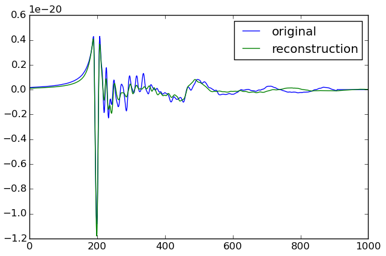

# ccsnmultivar companion code


This [Python](http://www.python.org/) module aids the analysis of core-collapse supernova gravitational waves.  It is the companion code for [this paper](http://arxiv.org/abs/1406.1164).

* **Multivariate Regression** of Fourier Transformed or Time Domain waveforms
* Hypothesis testing for measuring the influence of physical parameters
* Optionally incorporate additional uncertainty due to detector noise
* **Waveform reconstruction** and prediction
* Fit and analyze waveforms in Principal Component space
* Includes the [Abdikamalov et. al.](http://arxiv.org/abs/1311.3678) for use examples 

## Details
* Uses pandas for data handling
* A simplified formula language specific to this domain
* [Documentation](http://ccsnmultivar.readthedocs.org/en/latest/)


## Installation
Make sure that the python packages numpy, scipy, pandas, and patsy are already installed.
pip installer will install patsy, pandas and tabular if they aren't installed already.

    cd /path/to/ccsnmultivar

1. Download github zip file here
2. Unzip

```python
# 
cd /CCSNMultivar-master

python setup.py install
```
or

    pip install ccsnmultivar

Its a good idea to update often because the package is being changed often.  To update, type

    pip install -U ccsnmultivar

## Basic Walkthrough
Using the code happens in five steps:

1. Instantiate a Catalog object
2. Instantiate a Basis object.
3. Instantiate a DesignMatrix object.
4. Wrapping them in a Multivar object.
5. Analysis using the Multivar object's methods.

```python
# import code
import ccsnmultivar as cc

# load waveforms
path_to_waveforms = "/path/to/waveforms.dat"
# the Abdikamalov waveform file is called "Abdika13_waveforms.csv"

# we want to analyze the waveforms in the time domain, so instantiate
#    a Catalog object with the transform_type arguement specified
Y = cc.Catalog(path_to_waveforms,transform_type='time')
```

Note that Abdikamalov et al's 2013 waveform catalog and parameter file are included
in the Example_Waveforms directory of the GitHub repo as an example of how to format
the raw files for input.  To access these for the walkthrough, look at the right side
of the GitHub page, there is a toolbar with a Download button.  Download, then unzip.
The directory Example_Waveforms isn't included when the package is installed using pip.  

Now we need to make two objects, a Basis object and a DesignMatrix object

First we instantiate a Basis object.  Currently, there are two available types of 
Basis objects, with more planned.
 
1. PCA - using the Singular Value Decompostion (SVD)
2. ICA - Independent Component Ananlysis.  A wrapper for skearns [FastICA](http://scikit-learn.org/stable/modules/generated/sklearn.decomposition.FastICA.html)

```python
# use a PCA basis keeping the first 20 Principal Components
pca = cc.PCA(num_components=20)
```    
Next we instantiate a DesignMatrix object.

```python
# first, define a formula string describing how the physical parameters
#    need to be translated to the design matrix.  Say we only want to use
#    encodings of the parameters A and B (A is discrete, B is continuous)

formula = "A + B + A*B | Dum(A,ref=2), Poly(B,degree=4)"
```

The formula contains 5 peices of information that determine how the design matrix is 
encoded.  Reading the formula from left to right:

1. Include columns for the physical parameter named "A".
2. Include columns for the physical parameter named "B".
3. Include columns for interaction terms between parameters "A" and "B".  
The "|" character seperates instructions for *what* goes into the design matrix from 
*how* it goes in.
4. Use a dummy variable encoding on parameter "A".  One value of "A" needs to be used as a
reference in a dummy variable encoding, we chose value "2".
4. Use a chebyshev polynomial encoding on parameter "B".  Fit "B" with a 4th degree polynomial.

Now we instantiate the DesignMatrix object with two arguments: the formula, and the
path to the parameter file.
```python

# note that the provided Abdikamalov+ parameterfile is called "Abdika13_params.csv"
path_to_parameterfile = "/path/to/parameterfile.csv"

# note that we dont need to load the paramfile, just supply the path.
X = cc.DesignMatrix(path_to_parameterfile, formula)
```

Now with the waveforms in the Catalog object Y, the Basis object pca, and DesignMatrix object 
X on hand, we instantiate a Multivar object with these three arguements.

```python
# instantiate Multivar object
M = cc.Multivar(Y,X, pca)

```

This makes it easy to create many different Catalog, DesignMatrix, Basis, and Multivar
objects to test different fits and parameter influences very quickly.

```python
# now we do a fit to time domain waveforms (solve for B)
M.fit()

# print summary of the hypothesis tests, metadata, and other
# facts defined by the particular formula and basis used to make M.

M.summary()


Waveform Domain           time
Number of Waveforms       92
Catalog Mean Subtracted?  False
Catalog Name              Abdika13_waveforms.csv
Normalization Factor      2.45651978042e+20
Decomposition             PCA
num_components            10
================  ================  ===========
Comparison          Hotellings T^2      p-value
================  ================  ===========
Intercept              1129.44      1.11022e-16
A:[1 - 2]                87.9454    1.11022e-16
A:[3 - 2]                 8.06119   5.49626e-08
A:[4 - 2]                 1.8598    0.0700502
A:[5 - 2]                 0.823121  0.607991
beta^1                  257.711     1.11022e-16
beta^2                  383.961     1.11022e-16
beta^3                   93.1575    1.11022e-16
beta^4                   18.3438    1.55431e-14
A:[1 - 2]*beta^1         77.7596    1.11022e-16
A:[1 - 2]*beta^2         14.0067    3.68272e-12
     .                     .              .
     .                     .              .
     .                     .              .


# we can view the  waveform reconstructions with the Multivar method .reconstruct()
Y_reconstructed = M.reconstruct()

# and pull out the original catalog waveforms for comparison
Y_original = M.get_waveforms()

# plot the last waveform in the array with its reconstruction (requires matplotlib)
import matplotlib.pyplot as plt
plt.plot(Y_original[-1,8000:9000],label='original')
plt.plot(Y_reconstructed[-1,8000:9000],label='reconstruction')
plt.legend()
```
Using the Abdikamalov catalog, this is what you should see:


```python
# look at a summary of the overlaps of the waveforms and their reconstructions
M.overlap_summary()

============  ==============
Percentile    Overlap
============  ==============
5%:           0.64866522524
25%:          0.809185728124
50%:          0.879262580569
75%:          0.949587383571
95%:          0.97311500202

Min:          0.518678320514
Mean:         0.858585006085
Max:          0.98214781409
============  ==============


```

## Dependencies
* numpy
* scipy
* scikits-learn
* tabulate

## Planned
* Hotellings T2 with more than one GW detector
* Catalog objects
  - amplitude/phase decomposition, spectrograms
* other PC basis methods 
  - sparse basis decompositions, kmeans, etc.
* other design matrix fitting methods 
  - splines, rbfs, etc.
* different types of crossvalidation methods
* Gaussian Process (or other interpolation/machine learning method) classes


